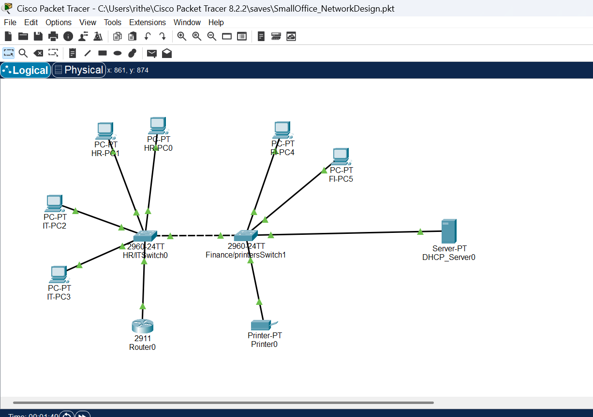

# 🏢 Small Office Network Design (Cisco Packet Tracer)

A Cisco Packet Tracer project simulating a small office network using VLANs, inter-VLAN routing (Router-on-a-Stick), and a centralized DHCP server. This network is designed for efficient segmentation, IP management, and inter-department communication in a small business environment.

---

## 📊 Topology Overview

---

## 🔧 Project Features

- 🔹 VLAN segmentation for HR, IT, and Finance departments
- 🔹 Inter-VLAN routing using router subinterfaces
- 🔹 Centralized DHCP server with separate pools for each VLAN
- 🔹 Fully functional PC-to-PC and PC-to-server connectivity
- 🔹 Trunk links between switches and router

---

## 🧩 Devices Used

| Device         | Quantity | Model         |
|----------------|----------|---------------|
| Router         | 1        | Cisco 2911    |
| Switch         | 2        | Cisco 2960    |
| PCs            | 6        | PC-PT         |
| Server         | 1        | Server-PT     |
| Printer        | 1        | Printer-PT    |

---

## 🌐 IP Addressing & VLANs

| Department | VLAN | Gateway         | DHCP Range              |
|------------|------|------------------|--------------------------|
| HR         | 10   | 192.168.10.1     | 192.168.10.11 - 192.168.10.254 |
| IT         | 20   | 192.168.20.1     | 192.168.20.11 - 192.168.20.254 |
| Finance    | 30   | 192.168.30.1     | 192.168.30.11 - 192.168.30.254 |

The DHCP Server (`192.168.30.10`) is statically configured in the Finance VLAN.

---

## 📁 Project Contents

- `SmallOffice_NetworkDesign.pkt` – Main Packet Tracer project file
- `topology.png` – Full screenshot of the network topology
- `README.md` – Project documentation

---

## ✅ Functional Testing

- ✔️ PCs receive IP addresses via DHCP
- ✔️ Inter-VLAN communication through router subinterfaces
- ✔️ Server and printer accessible from all departments
- ✔️ Trunk links tested and stable
- ✔️ No packet loss during ping tests

---

## 📚 Learning Outcomes

- Understand VLAN configuration and switchport assignment
- Practice inter-VLAN routing with subinterfaces
- Deploy and configure DHCP scopes
- Apply trunking between switches and routers
- Troubleshoot and verify end-to-end connectivity

---

## 👨‍💻 Author

Designed and implemented by **[Rithesh Reddy Baroor]**  
[LinkedIn](https://www.linkedin.com/in/ritheshreddy16/)

---

